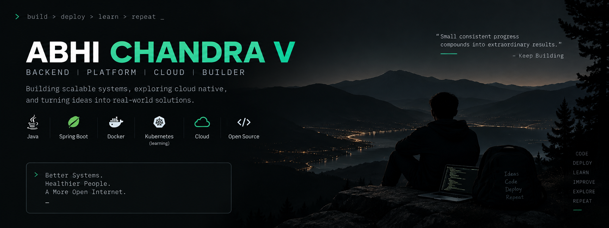

 

---

### About Me

- 🔧 I design and run **backend services** and the **platform** underneath them — think APIs, data stores, and the Kubernetes/Terraform/CI-CD plumbing that ships them safely.
- 🏗️ I care about systems that are correct under load, cheap to operate, and boring to debug at 3am.
- 📈 Interested in observability, cost-aware infra, and making deploys a non-event.
- 🌱 Currently exploring: <!-- TODO: e.g. "GitOps with ArgoCD", "eBPF observability", "service mesh" -->
- 💬 Ask me about: API design, container orchestration, infrastructure-as-code, CI/CD pipelines

⚡ A few more things about me

 

<!-- TODO: swap these for real facts about you -->
- 🖥️ Daily drivers: <!-- e.g. Neovim, tmux, WSL2 -->
- 📦 Last thing I shipped: <!-- short blurb -->
- 🎯 2026 goal: <!-- e.g. "get a system to 99.99% uptime without babysitting it" -->
- ☕ Fueled by: coffee and `kubectl logs -f`

---

### Tech Stack

**Languages**

**Backend & APIs**

**Data & Messaging**

**Platform & Infra**

**Cloud & CI/CD**

**Observability**

---

### Featured Projects

<!-- TODO: swap these for your real repos — keep the format, edit link/description -->

---

### GitHub Stats

<!-- theme-adaptive: picks the SVG that matches the viewer's OS/browser light-dark setting -->

<picture>
  <source media="(prefers-color-scheme: dark)" srcset="https://github-readme-stats.vercel.app/api?username=abhichandra-v&show_icons=true&hide_border=true&count_private=true&theme=tokyonight" />
  
</picture>
<picture>
  <source media="(prefers-color-scheme: dark)" srcset="https://github-readme-stats.vercel.app/api/top-langs/?username=abhichandra-v&layout=compact&hide_border=true&theme=tokyonight" />
  
</picture>

 

<picture>
  <source media="(prefers-color-scheme: dark)" srcset="https://github-readme-streak-stats.herokuapp.com/?user=abhichandra-v&hide_border=true&theme=tokyonight" />
  
</picture>

---

### Trophies

---

### Activity Graph

<picture>
  <source media="(prefers-color-scheme: dark)" srcset="https://github-readme-activity-graph.vercel.app/graph?username=abhichandra-v&theme=github-compact&hide_border=true&bg_color=0d1117" />
  
</picture>

---

### Contribution Snake 🐍

<!-- Generated by a GitHub Action (.github/workflows/snake.yml) — see that file's comments for the one-time setup -->

<picture>
  <source media="(prefers-color-scheme: dark)" srcset="https://raw.githubusercontent.com/abhichandra-v/abhichandra-v/output/github-contribution-grid-snake-dark.svg" />
  
</picture>

---

### Let's Connect

<!-- TODO: fill in your real links, then delete this comment -->

